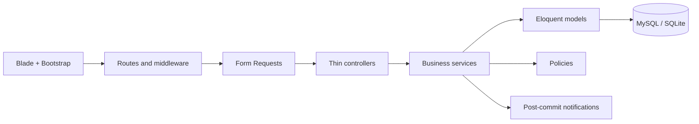

# OpsFlow

OpsFlow is a Laravel spend-management application for routing Purchase Requests, Supplier Invoices, and Expense Claims through configurable approval workflows. It is a portfolio-scale V1 focused on the parts that make approval systems difficult: authoritative calculations, deterministic routing, immutable history, authorization, and safe concurrent state changes.

The application uses server-rendered Blade views and Bootstrap 5. It is a conventional Laravel monolith with no SPA framework and no generic permission or workflow package.

## What it solves

Teams often coordinate spend approvals through email and chat, making it hard to answer who owns a decision, which policy applied, or whether a request changed after approval. OpsFlow provides:

- Three complete spend modules with multi-line draft editing and submission.
- Versioned workflow configuration for amount, department, and category rules.
- A query-backed approval inbox with approve, reject, and request-changes actions.
- Resubmission and withdrawal without deleting prior decisions.
- Private attachments, database notifications, audit records, and operational dashboards.
- Preserved references and history for every submitted business record.

## V1 modules

| Area | Implemented behavior |
| --- | --- |
| Purchase Requests | Employee-owned drafts, multiple integer-quantity items, server totals, submit, resubmit, withdraw, and approval history. |
| Supplier Invoices | Finance/Admin access, vendor invoice uniqueness, four-decimal quantities, required private document, and approval workflow. |
| Expense Claims | Employee-owned claims, item-level receipts, gross-amount totals, routing by the highest-value item, and stable tie-breaking. |
| Workflow Configuration | Draft versions, ordered rule groups and steps, validation, publishing, cloning, and immutable published versions. |
| Approval Operations | Sequential `ANY` steps, persisted assignments, first-committed-action-wins decisions, next-step activation, and final outcomes. |
| Operations | Role-aware dashboard summaries, approval timelines, notifications, and focused activity auditing. |

## Architecture



Form Requests validate input, Policies enforce resource access, and Services own multi-record business transitions. Controllers coordinate HTTP concerns and do not implement approval state machines. The code remains organized as coherent Laravel vertical slices rather than repository layers or a distributed service architecture.

### Workflow configuration and runtime

Configuration and execution are separate:

```text
WorkflowTemplate → WorkflowVersion → RuleGroup → Rule → WorkflowStep

Business record → ApprovalInstance → ApprovalStepInstance
                                  → ApprovalAssignment
                                  → ApprovalAction
```

Rules within a group use `AND`. Non-default groups are evaluated by `priority ASC, id ASC`; the first match wins, and the default group is fallback only. Amount comparisons use the same decimal-safe Money value object as business totals.

Submission stores the exact published WorkflowVersion, matched RuleGroup, routing context, and a snapshot of every step. Published configuration remains immutable. ApprovalAction is append-only and is the authoritative decision history.

V1 executes steps sequentially in `ANY` mode. Approvers are resolved only when a step becomes active. For an `ANY` step, the first valid committed decision wins and sibling assignments become non-actionable.

### Resubmission

After changes are requested, OpsFlow compares the persisted routing snapshot with the current amount, department, and category:

- Non-routing edits resume the same instance and current step with fresh assignments.
- A routing change is resolved and validated before the old runtime changes.
- If the version and rule group are unchanged, the existing runtime resumes.
- If the route changes, the old runtime is preserved as cancelled and a new instance starts from step one.

Rejected and withdrawn records are final in V1.

### Transactions and concurrency

Submit, approve, reject, request changes, resubmit, and withdraw execute in database transactions. State is re-read after locks are acquired in the consistent order:

```text
Business record → Approval instance → Step instance → Assignment
```

This protects double submission, stale actions, competing `ANY` decisions, withdrawal-versus-approval races, duplicate runtime creation, and partial transitions. Authoritative audit and approval history writes share the transaction. Database notifications are created after a successful commit and never determine business state.

### Authorization and data integrity

- Authentication rejects inactive users, and lifecycle services recheck persisted actor state.
- Ownership and operational visibility are enforced in Policies and scoped list queries.
- Approval authority comes from a persisted pending assignment, not from a broad role.
- Self-approval and unavailable or inactive approvers fail safely.
- Supplier Invoice visibility does not grant approval authority to Finance or Admin.
- Attachments use private storage and are downloaded through an authorized controller.
- Drafts may be hard-deleted; submitted business records and runtime/audit history are preserved.
- Blade escaping remains enabled for user-controlled output.

### Money correctness

Database money columns use `DECIMAL(15,2)`. Supplier Invoice quantity uses `DECIMAL(15,4)`. PHP calculations use an integer-minor-unit Money value object and validated decimal strings; authoritative paths do not use binary floating point.

The backend recalculates every subtotal, tax, and total. Expense item amounts are gross, so informational tax is not added again. Frontend totals, ownership, status, department, and approval fields are never treated as authoritative.

## Technology

- PHP 8.3+
- Laravel 13
- MySQL for the production-aligned deployment target
- SQLite for the zero-configuration local demo and test suite
- Blade, Bootstrap 5, and Vite
- PHPUnit 12
- Laravel database notifications and private filesystem storage

## Local setup

Install PHP 8.3+, Composer, and Node.js. Then:

```bash
git clone <repository-url> opsflow
cd opsflow
composer install
cp .env.example .env
php artisan key:generate
npm install
npm run build
```

The example environment uses SQLite. Create the database file before migrating:

```bash
touch database/database.sqlite
php artisan migrate:fresh --seed
```

On PowerShell, create it with:

```powershell
New-Item database/database.sqlite -ItemType File -Force
php artisan migrate:fresh --seed
```

For MySQL, set `DB_CONNECTION=mysql` and the `DB_HOST`, `DB_PORT`, `DB_DATABASE`, `DB_USERNAME`, and `DB_PASSWORD` values before running migrations.

Start the application and Vite development server:

```bash
composer run dev
```

The application is available at the `APP_URL` configured in `.env`.

## Demo data and credentials

`php artisan migrate:fresh --seed` creates deterministic fictional data intended only for a local portfolio demo. These credentials are not production secrets, and the `.test` addresses do not represent real users.

All demo accounts use the password `OpsFlowDemo!`.

| Perspective | Email | Useful screens |
| --- | --- | --- |
| Administrator | `admin@opsflow.test` | Dashboard, users, master data, and published workflow configuration. |
| Employee | `employee@opsflow.test` | Drafts, changes requested, resubmission, withdrawal, notifications, and record history. |
| IT manager | `it.manager@opsflow.test` | Approval inbox for employee requests and claims. |
| Finance lead | `finance@opsflow.test` | Finance dashboard, supplier invoices, and Finance approval steps. |
| Finance analyst | `analyst@opsflow.test` | Supplier Invoice creation and operational views. |
| Director | `director@opsflow.test` | Final high-value approval steps after earlier reviewers approve. |

The seed can be invoked again safely when the complete demo set already exists. If a prior seed was interrupted, rebuild the local demo with `php artisan migrate:fresh --seed`.

## Interview walkthrough

1. Sign in as the Administrator and open **Workflows**. Show the three published versions and the ordered rule groups for Purchase Requests, Supplier Invoices, and Expense Claims.
2. Sign in as the Employee. Open **Purchase requests** to compare draft, in-approval, changes-requested, resubmitted, withdrawn, and approved histories.
3. Open **Notifications**, then sign in as the IT manager and process a pending assignment from the **Approval inbox**.
4. Request changes on an employee record, return as the Employee to edit and resubmit it, and show that its previous actions remain in the timeline.
5. Sign in as the Finance lead to show Finance-only operational summaries, invoice visibility, decimal quantities, private attachments, and an active Finance step.
6. Use the seeded high-value records to explain deterministic routing and how the Director step activates only after prior approvals.

For portfolio screenshots, the strongest views are the role-aware dashboard, a populated approval inbox, an approval detail page with attachments and timeline, the workflow-version configuration screen, and side-by-side business records in different lifecycle states. The seed data supplies each state without requiring manual setup.

## Testing

Run the full suite:

```bash
php artisan test --compact
```

Run focused areas while developing:

```bash
php artisan test --compact tests/Feature/WorkflowEngineTest.php
php artisan test --compact tests/Feature/ApprovalOperationsTest.php
php artisan test --compact tests/Feature/ResubmissionWithdrawalTest.php
php artisan test --compact tests/Feature/DemoSeederTest.php
```

Format changed PHP files and compile Blade templates with:

```bash
vendor/bin/pint --dirty --format agent
php artisan view:cache
```

The suite covers authorization and IDOR boundaries, decimal calculations, workflow resolution, rollback behavior, stale/repeated transitions, approval history, private attachments, notifications, operational views, migrations, and demo reproducibility.

## Deliberate V1 boundaries

OpsFlow V1 does not execute payments, reimbursements, purchase orders, budgets, accounting synchronization, delegation, parallel workflows, or AI decisions. Approved records are ready for a downstream business process; they are not paid or reimbursed.

Potential later AI work includes document extraction, receipt extraction, category suggestions, approval summaries, and anomaly hints. Those capabilities remain advisory and outside authoritative totals, routing, and approval decisions.

## License

OpsFlow is available under the MIT License.
